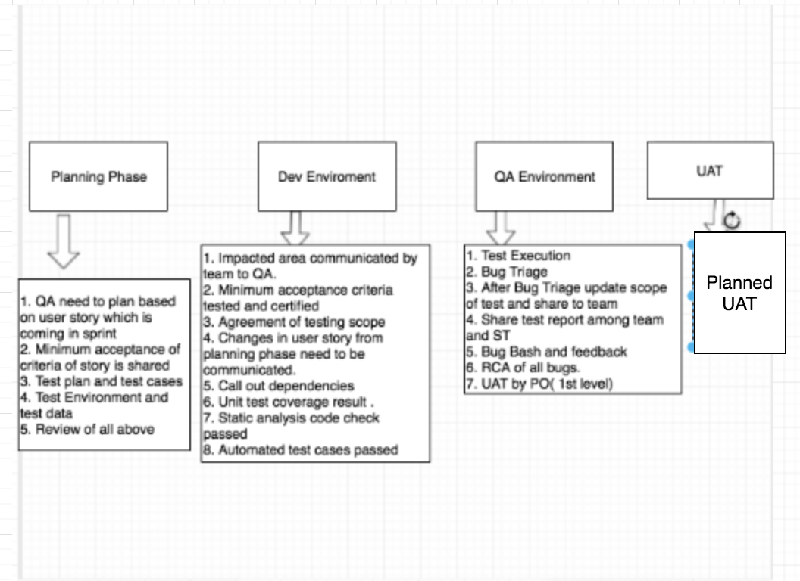

# TestProcess
Test Process


##What we do in Bug Bash ?

```
In software development, a bug bash is a procedure where all the developers, testers, program managers, usability researchers, designers, documentation folks, and even sometimes marketing people, put aside their regular day-to-day duties and "pound on the product".

Who are involved ? People involved are product team members stakeholders only.
Which environment ? QA Environment
How much time ? Its last for 30 min to 1 hours.
Ideally team organise with some food .
Team will have all major business critical flow predefined and informed to all participant and it must be executed by all participant (This process should consumed only half of the organised time).
Rest half of the time team can do some exploratory testing and talk about product.
Common shared google form will be accessible to all participant and where participant write their opinion about the products and bugs they found during above process
Why Bug bash is done in QA  ? Team should complete execution of all user story on agreed scope. and team proceed to have a bug bash because team assume there is no continuous change deployed to QA environment and with some amount of testing done.
```
##What do we do in Bug Triage ?

```
Bug triage is a process where tracker issues are screened and prioritised. Triage should help ensure we appropriately manage all reported issues - bugs as well as improvements and feature 

Bug Triage is a  meeting scheduled by QA, where QA will represent all the bugs together with PO and developer and have a discussion what needs to be fix or not ?
Why do team have Test Plan ?

Test Plan helps team to analysing the high level scope, approach and risks on projects/user story with roughly estimated timelines.
```
##Why do team have Minimum Acceptance Criteria ?

 ```
 1. Minimum Acceptance Criteria helps team to pre-check conditions that a software product must satisfy to be accepted before handing over a new build to QA .
```
##Why do team have Impacted Area ?

```
Impacted Area helps team to figure out risks and shorten the scope of testing in Agile environment.
Why do team have Test Scope defined ?

    1.  Test scope must defined based on impacted area + critical business flow + find the existing test (unit test, automated test) what are the risks need to be called out to the team.

    2.  Test scope help team to analyse the test coverage for the new software builds to QA.
 ```

##Why do team have RCA of Bugs ?

```
RCA is a practice to predicated on the belief that problems are best solved by attempting to correct or eliminate root causes by addressing obvious symptoms . By directing corrective measures at root causes, it is hoped that the likelihood of problem reoccurrence will be minimised.
```

